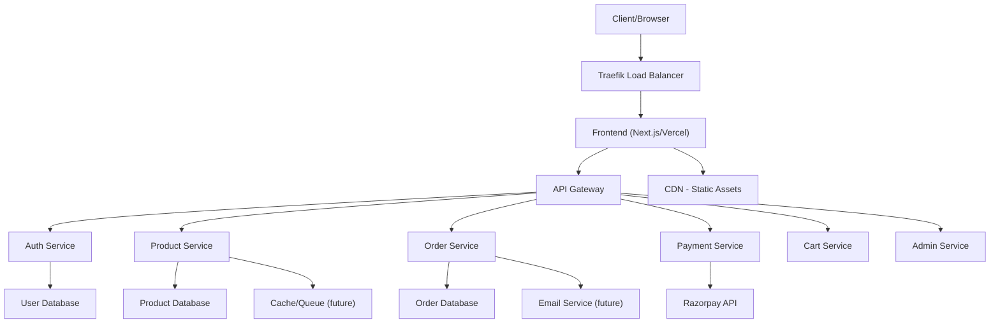

# 🛒 E-commerce Microservices Platform

[](https://github.com/sanketp1/ecommerce-microservices/actions)
[](https://codecov.io/gh/sanketp1/ecommerce-microservices)
[](LICENSE)
[](package.json)
[](https://www.python.org)
[](https://nodejs.org)
[](https://www.docker.com/)
[](https://render.com/)
[](CONTRIBUTING.md)

---

## 📦 Overview

**E-commerce Microservices Platform** is a modern, production-grade, cloud-native e-commerce solution built with a microservices architecture. It leverages FastAPI, Next.js, Docker, and MongoDB to deliver a scalable, modular, and developer-friendly platform for online retail. Designed for extensibility, high availability, and real-world business needs, this project is ideal for startups, learning, and enterprise prototyping.

---

## 🚀 Live Preview

- **Frontend:** [ecommerce-microservices-two.vercel.app](https://ecommerce-microservices-two.vercel.app/)
- **Demo Video:** *Coming Soon or insert your actual video URL*

---

## 🛠️ Tech Stack


---

## 🗂️ Microservices & API Docs

| Service   | Documentation URL                                                                   |
|-----------|-------------------------------------------------------------------------------------|
| Auth      | [Auth Service Docs](https://auth-service-v19t.onrender.com/auth/docs)               |
| Product   | [Product Service Docs](https://product-service-i3pr.onrender.com/api/products/docs) |
| Cart      | [Cart Service Docs](https://cart-service-g9v1.onrender.com/api/cart/docs)           |
| Payment   | [Payment Service Docs](https://payment-service-2bg9.onrender.com/api/payments/docs) |
| Order     | [Order Service Docs](https://order-service-34yt.onrender.com/api/orders/docs)       |
| Admin     | [Admin Service Docs](https://admin-service-553d.onrender.com/api/admin/docs)        |

---

## 🌟 Key Features

- **Authentication & Authorization**: Secure JWT and Google OAuth2 login flows
- **Product Catalog & Search**: Admin-managed listings, advanced filters, and search
- **Persistent Shopping Cart**: Real-time, per-user cart with session persistence
- **Payments Integration**: Secure checkout via Razorpay
- **Admin Dashboard**: Analytics, user/order/product management
- **Order Tracking**: End-to-end delivery and status updates
- **Scalable Microservices**: Each service is independently deployable and scalable
- **API-First Design**: OpenAPI/Swagger docs for every service
- **Docker-First Development**: All services containerized for local and cloud
- **CI/CD**: Automated testing and deployment with GitHub Actions
- **Cloud Native**: Ready for Render, Vercel, or Kubernetes

---

## 🏗️ Architecture

### System Overview

The platform is composed of multiple independent microservices, each responsible for a business domain. Services communicate via REST APIs and share no database. Traefik or an API Gateway routes requests to the correct service. MongoDB is used for data storage, and the frontend is built with Next.js for SSR and SPA capabilities.



### Service Responsibilities
- **Auth Service**: User registration, login, JWT, OAuth2
- **Product Service**: Product CRUD, search, categories
- **Cart Service**: User cart management
- **Order Service**: Order placement, tracking
- **Payment Service**: Payment processing, integration
- **Admin Service**: Admin panel, analytics

---

## ⚙️ Configuration & Environment Variables

Each service requires environment variables for secure and flexible configuration. See each service's `README.md` or `.env.example` for details. Common variables include:

- `MONGODB_URI`: MongoDB connection string
- `JWT_SECRET_KEY`: Secret for JWT tokens
- `GOOGLE_CLIENT_ID` / `GOOGLE_CLIENT_SECRET`: For OAuth2
- `RAZORPAY_KEY_ID` / `RAZORPAY_KEY_SECRET`: For payments
- `PORT`: Service port (used by Docker/Render)

**Tip:** Use Docker secrets or Render dashboard for production secrets.

---

## 🚀 Getting Started

### Prerequisites

- Python 3.10+
- Node.js 18+
- Docker & Docker Compose
- MongoDB (local or Atlas)
- Git

### Local Development

Clone the repository:
```bash
git clone https://github.com/sanketp1/ecommerce-microservices.git
cd ecommerce-microservices
```

Install backend dependencies:
```bash
for service in auth-service product-service cart-service payment-service order-service admin-service; do
  cd $service
  pip install -r requirements.txt
  cd ..
done
```

Install frontend dependencies:
```bash
cd e-commerce-frontend
npm install
```

Start MongoDB (if local):
```bash
sudo systemctl start mongod
```

Run backend services (in separate terminals):
```bash
uvicorn app.main:app --reload  # per service
```

Run frontend:
```bash
npm run dev
```

### Docker Compose (Recommended)

```bash
docker-compose up -d --build
docker-compose logs -f
docker-compose down
```

Access:
- Frontend: [http://localhost:3000](http://localhost:3000)
- Traefik Dashboard: [http://localhost:8080](http://monitor.localhost:8080)

### Cloud Deployment

- **Render**: Deploy using `render.yaml` blueprint. Each service is a Render web service.
- **Vercel**: Deploy frontend for global CDN and SSR.
- **MongoDB Atlas**: Use for managed cloud database.

---

## 🧪 Testing & Quality

Run backend tests:
```bash
for service in auth-service product-service cart-service payment-service order-service admin-service; do
  cd $service
  python -m pytest
  cd ..
done
```

Run frontend tests:
```bash
cd e-commerce-frontend
npm run test
```

- **CI/CD**: All PRs and pushes are tested via GitHub Actions.
- **Coverage**: See Codecov badge above.

---

## 🛡️ Security & Best Practices

- All secrets managed via environment variables
- HTTPS enforced in production
- Linting and formatting enforced via CI
- Follows 12-factor app principles

---

## 🧩 Extending & Customizing

- Add new microservices by following the existing structure
- Integrate with other payment gateways or analytics tools
- Customize frontend themes with Tailwind CSS

---

## 📝 FAQ & Troubleshooting

**Q: MongoDB connection fails on Render/Atlas?**
A: Ensure your URI uses `tls=true` and `tlsAllowInvalidCertificates=true` if needed. Check IP whitelist and credentials.

**Q: Docker Compose port conflicts?**
A: Make sure each service uses a unique `PORT` in `docker-compose.yml` and `.env`.

**Q: How do I reset the database?**
A: Drop collections in MongoDB or use the provided `init-mongo.js` script.

**Q: How do I add a new service?**
A: Copy an existing service folder, update the API, and register it in `docker-compose.yml` and `render.yaml`.

---

## 🤝 Contributing

1. Fork the repository
2. Create your branch (`git checkout -b feature/AmazingFeature`)
3. Commit and push your changes
4. Open a Pull Request

See [CONTRIBUTING.md](CONTRIBUTING.md) for details.

---

## 📝 License

Licensed under the MIT License. See the [LICENSE](LICENSE) file.

---

## 🙏 Acknowledgments

- Thanks to all contributors
- Inspired by modern e-commerce platforms
- Powered by open source

---

## 📞 Support

- GitHub Issues
- Email: [psanket18052001@gmail.com](mailto:psanket18052001@gmail.com)

---

<div align="center">
  <h3>Made with ❤️ by Sanket</h3>
  <p>
    <a href="https://github.com/sanketp1">GitHub</a> •
    <a href="https://linkedin.com/in/psanket18">LinkedIn</a> •
    <a href="https://twitter.com/p_sanket18">Twitter/X</a>
  </p>
</div>
