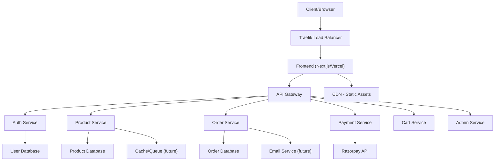

# 🛒 E-commerce Microservices Platform

[](https://github.com/sanketp1/ecommerce-microservices/actions)
[](https://codecov.io/gh/sanketp1/ecommerce-microservices)
[](LICENSE)
[](package.json)
[](https://www.python.org)
[](CONTRIBUTING.md)

> A modern, scalable microservices-based e-commerce platform built using **FastAPI**, **Next.js**, **Docker**, and **MongoDB** — optimized for modularity, performance, and developer experience.

---

## 🚀 Live Preview

* **Frontend:** [ecommerce-microservices-two.vercel.app](https://ecommerce-microservices-two.vercel.app/)
* **Demo Video:** *Coming Soon or insert your actual video URL*

---

## 🛠️ Tech Stack


---

## 🗂️ Microservices & API Docs

| Service | Documentation URL                                                                   |
| ------- | ----------------------------------------------------------------------------------- |
| Auth    | [Auth Service Docs](https://auth-service-v19t.onrender.com/auth/docs)               |
| Product | [Product Service Docs](https://product-service-i3pr.onrender.com/api/products/docs) |
| Cart    | [Cart Service Docs](https://cart-service-g9v1.onrender.com/api/cart/docs)           |
| Payment | [Payment Service Docs](https://payment-service-2bg9.onrender.com/api/payments/docs) |
| Order   | [Order Service Docs](https://order-service-34yt.onrender.com/api/orders/docs)       |
| Admin   | [Admin Service Docs](https://admin-service-553d.onrender.com/api/admin/docs)        |

---

## 🌟 Key Features

* 🔐 **Authentication & Authorization** – JWT, Google OAuth2
* 🛍️ **Product Catalog & Search** – Admin-managed listings with filters
* 🛒 **Persistent Shopping Cart** – Real-time updates per user session
* 💳 **Payments Integration** – Secure checkout via Razorpay
* 📊 **Admin Dashboard** – Analytics, user/order/product management
* 🚚 **Order Tracking** – End-to-end delivery flow
* 🧠 **Scalable Microservices Architecture** – Independent deployments
* 🐳 **Docker-First Development** – Built for containerization

---

## 🏗️ Architecture Diagram



---

## 🚀 Getting Started

### Prerequisites

* Python 3.10+
* Node.js 18+
* Docker & Docker Compose
* MongoDB (if running locally)
* Git

### Manual Setup

```bash
git clone https://github.com/sanketp1/ecommerce-microservices.git
cd ecommerce-microservices
```

Install service dependencies:

```bash
for service in auth-service product-service cart-service payment-service order-service admin-service; do
  cd $service
  pip install -r requirements.txt
  cd ..
done
cd e-commerce-frontend
npm install
```

Run MongoDB and start services:

```bash
sudo systemctl start mongod
uvicorn app.main:app --reload  # per service
npm run dev  # for frontend
```

### Docker Quick Start

```bash
docker-compose up -d --build
docker-compose logs -f
docker-compose down
```

Access:

* Frontend: [http://localhost:3000](http://localhost:3000)
* Traefik Dashboard: [http://monitor.localhost:8080](http://monitor.localhost:8080)

---

## 🧪 Testing

```bash
for service in auth-service product-service cart-service payment-service order-service admin-service; do
  cd $service
  python -m pytest
  cd ..
done
```

---

## 🤝 Contributing

1. Fork the repository
2. Create your branch (`git checkout -b feature/AmazingFeature`)
3. Commit and push your changes
4. Open a Pull Request

See [CONTRIBUTING.md](CONTRIBUTING.md) for details.

---

## 📝 License

Licensed under the MIT License. See the [LICENSE](LICENSE) file.

---

## 🙏 Acknowledgments

* Thanks to all contributors
* Inspired by modern e-commerce platforms
* Powered by open source

---

## 📞 Support

* GitHub Issues
* Email: [psanket18052001@gmail.com](mailto:psanket18052001@gmail.com)

---

<div align="center">
  <h3>Made with ❤️ by Sanket</h3>
  <p>
    <a href="https://github.com/sanketp1">GitHub</a> •
    <a href="https://linkedin.com/in/psanket18">LinkedIn</a> •
    <a href="https://twitter.com/p_sanket18">Twitter/X</a>
  </p>
</div>
